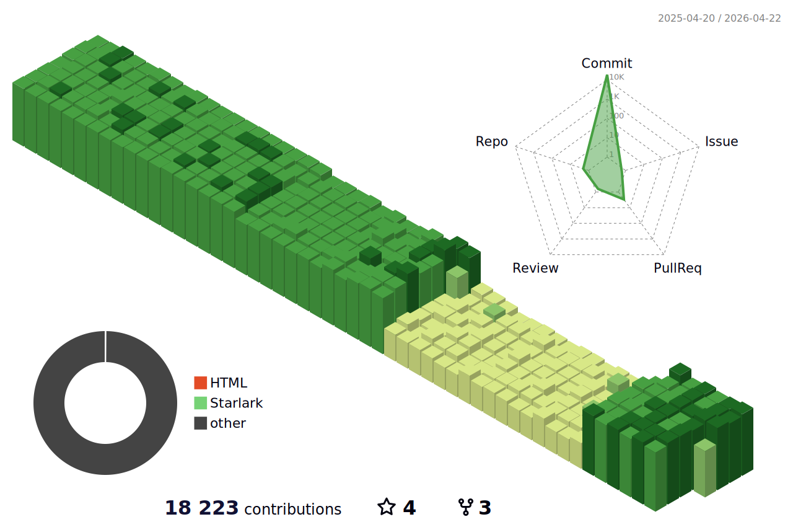

<!--   my-header-img -->

<!--   my-ticker -->    

<!--   GitHub stats graph -->
### 📈 GitHub Activity Graph:
<!--  -->

| .                                                                                                                                       | .                                                                                                                         |
|-----------------------------------------------------------------------------------------------------------------------------------------|---------------------------------------------------------------------------------------------------------------------------|
|  | </img> |

<!--   profile-green-animate -->

 

